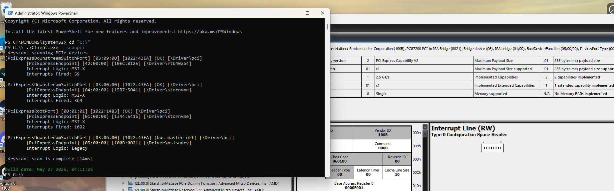
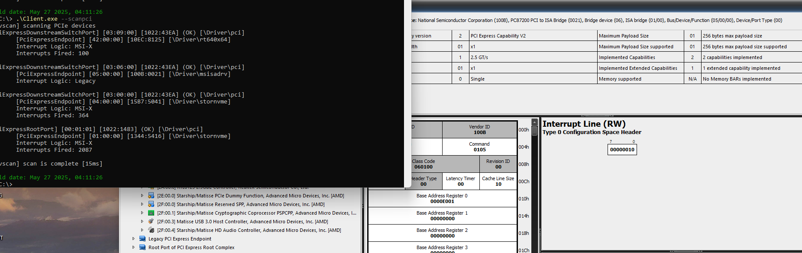

# Pcileech-ISABridge-PC8

FPGA mimicking a PCI - ISA Bridge. Has not been tested thrououghly and has been made for researching purposes only; I do know it is no beuno for VGK or EAC in its current state even with modifications to pass driver scan.

Issues with firmware in its current state:

1.) Command Register is zero'd out when driver loads; I cannot seem to get it to set the command register. If you set the command register manually using software it will pass the driver test & it passes the speed test with flying colors. 
If you can figure out how to fix the command register I'd happily commit it to this repo. 

2.) Interrupts are not firing; 

More Info:

This firmware is based on a datasheet for a chip that was not used for pcie devices but in industrial motherboards and I/O devices that required an ISA Bridge. Datasheet has been provided.

Both the Caps & Extended Caps I implemented from scratch as the datasheet does not have that information included; If you create firmware from this device without the capabilities included it will fail the driver scan with a capability error as well as 
fail to initialize the linking speed/width values.

**Changes 6/13/2025**
*Removed I/O BAR as this device although has the I/O Bar enabled in the command register, does not use an I/O or Memory BAR. 
*Removed propbing for BAR size and configuration of the BAR as it is not neccessary.

*Added configuration for unique registers specific to this device in the cfg_a7.sv file. 
*Moved caps to reserved offset space outside of the unique registers offset space to prevent confliction. 

[Datasheet](PC87200.PDF)
