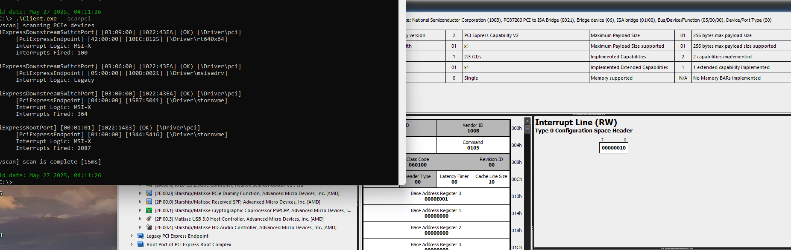

# Pcileech-ISABridge-PC8

**CHANGE SUBSYSTEM VENDOR ID & SUBSYSTEM ID TO MATCH YOUR SYSTEM ID'S!**

*Info:*

This firmware is based on a datasheet for a chip that was not used for pcie devices but in industrial motherboards and I/O devices. I have implmented PM and PCIe caps so that the device can function as a PCIe device. Datasheet has been provided with the configuration space registers defined.

Driver Scan doesn't detect interrupts being generated, but neither does it complain about it. Interrupts may or may nor be working.

- [Datasheet](PC87200.PDF)

- 

- 
